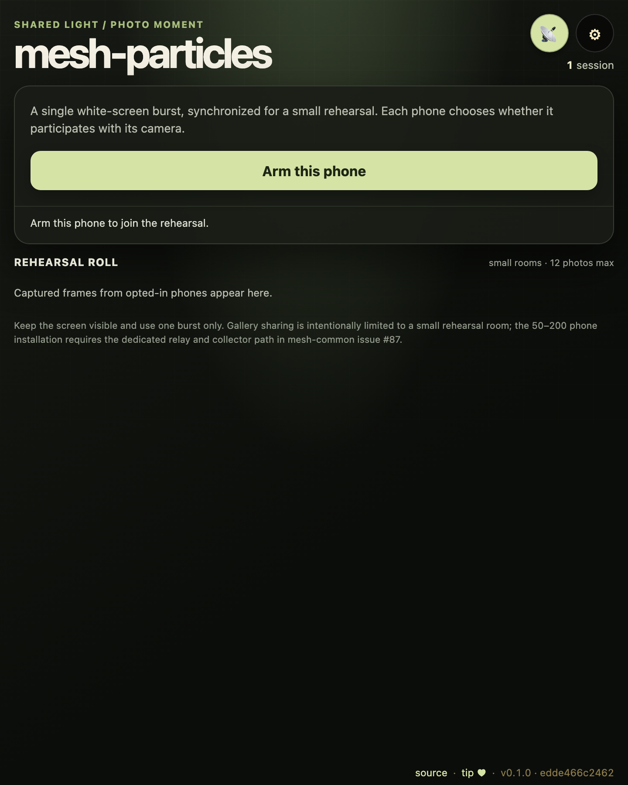
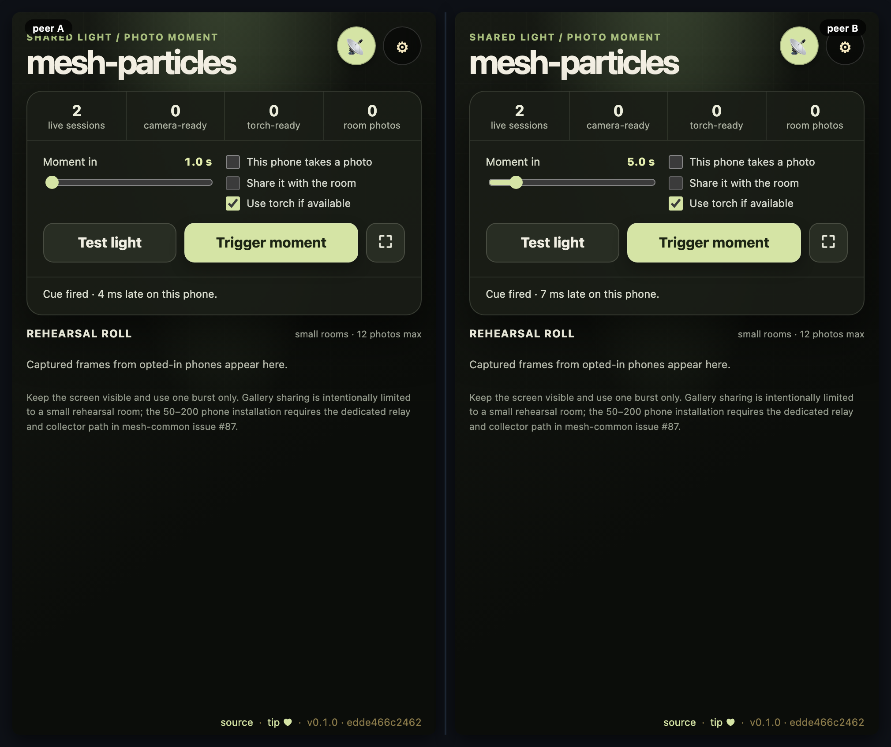

# mesh-particles

[](https://baditaflorin.github.io/mesh-particles/)
[](https://github.com/baditaflorin/mesh-particles/blob/main/package.json)
[](./LICENSE)

> Installation rehearsal: synchronized screen light, opt-in camera capture, and a small shared photo roll.

**Live → https://baditaflorin.github.io/mesh-particles/**

**Source → https://github.com/baditaflorin/mesh-particles**

**Tip the dev (buy a coffee) → https://www.paypal.com/paypalme/florinbadita**

---



> Two peers, side-by-side, in the same room. Drop a `tests/demo/scenario.mjs`
> exporting `default async (a, b) => …` and run `npm run demo` to regenerate
> `docs/preview.png` plus `docs/demo-a.webm` / `docs/demo-b.webm` clips.



## What it is

`mesh-particles` rehearses the visual language of a larger installation: many recycled phones held by cast hands create one sudden white-screen flash, with optional rear-camera capture and hardware torch.

The rehearsal mode is a **rootless-computing** Yjs/WebRTC room. It is deliberately intended for small field tests, not as the final 200-phone topology. An opted-in phone can put a compressed cue frame in the shared room so every participant receives it in the rehearsal roll. That path is bounded to 12 photos and 800 KB per photo; it is not the 50–200 phone collection path, which needs a dedicated collector relay.

Tap a thumbnail to open the frame viewer rather than downloading immediately. It supports previous/next controls and touch swipes, and exposes the capture time, stable per-app device ID, and ephemeral session ID for rehearsal debugging. Download remains an explicit action in that viewer.

### Capability truth

- The screen flash works everywhere once the page is armed and visible.
- Camera capture is a frame from an explicitly permitted rear-camera stream; it does **not** open the native camera app. Sharing is a separate per-phone opt-in.
- Torch is checked per device and is optional. It should never be treated as a guaranteed photo flash.
- The single cue is not a repeated strobe. The app shows an explicit warning and always offers cancellation before it fires.

Read the principles → **https://baditaflorin.github.io/rootless-computing/principles.html**

## Quickstart

Open the live URL on two devices in the same room (set in ⚙ settings, or scan the room QR). Arm each device, set the **Moment in** countdown to 1–30 seconds, then use **Test light** before the camera/torch rehearsal. Enable photo participation only on devices whose operators consent; toggle **Share it with the room** if the resulting frame should appear for every participant.

The readiness number is deliberately labelled **live sessions**, not phones: WebRTC awareness sees browser sessions, so one physical phone can appear more than once after a reload, reconnect, or a second browser. If the room is not connected, the app blocks a shared trigger and offers **Reconnect room** instead of pretending the cue was sent. The exact one-second minimum is supported.

For local hacking:

```bash
git clone https://github.com/baditaflorin/mesh-common
git clone https://github.com/baditaflorin/mesh-particles
cd mesh-particles
npm install
npm run dev
```

`mesh-common` must sit as a **sibling** directory because `package.json` references it via `file:../mesh-common`.

## Self-hosted infrastructure

| Repo                                              | Endpoint                               | Purpose                     |
| ------------------------------------------------- | -------------------------------------- | --------------------------- |
| https://github.com/baditaflorin/signaling-server  | `wss://turn.0docker.com/ws`            | y-webrtc signaling fan-out  |
| https://github.com/baditaflorin/turn-token-server | `https://turn.0docker.com/credentials` | HMAC TURN creds, 1-hour TTL |
| https://github.com/baditaflorin/coturn-hetzner    | `turn:turn.0docker.com:3479`           | TURN relay                  |

## Settings overrides

The settings drawer lets the user override signaling and TURN endpoints. localStorage keys:

- `mesh-particles:signalingUrl`
- `mesh-particles:turnTokenUrl`
- `mesh-particles:iceServers`
- `mesh-particles:room`

If endpoints are blank or unreachable, the app falls back to STUN-only.

## Version + commit on every screen

The bottom-right footer on every screen of the live app shows:

- `source` → this repo
- `tip ♥` → PayPal
- `vX.Y.Z · <short-sha>` — version from `package.json` plus the build-time git commit

## Build & deploy

GitHub Pages serves the committed `docs/` directory on the `main` branch. There is no GitHub Actions build workflow; local Husky-style hooks gate formatting / typecheck / smoke build before each push.

```bash
npm run smoke                                    # build + sanity-check docs/
bash ../mesh-common/scripts/screenshot-app.sh    # regenerate docs/screenshot.png
```

## Privacy

<!-- mesh:privacy-section:start -->

The shared room carries a small scheduled cue, ephemeral capability flags, and only the compressed photo frames whose operators explicitly enabled room sharing. Each shared frame includes an anonymous per-app device ID for debugging; it persists on that browser for this app but cannot identify or correlate a person across the rest of the Mesh fleet. Camera and torch permissions are requested only after an explicit arming action. The room URL is access control—share it deliberately.

See `docs/privacy.md` for the full threat model — capabilities used, what other peers in the mesh see, what the self-hosted infra sees, what stays local.
<!-- mesh:privacy-section:end -->

## License

MIT — see `LICENSE`.
